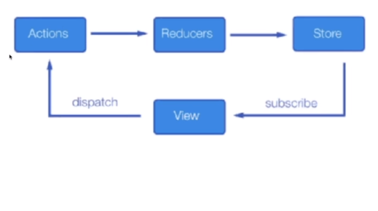

# REDUX

 

`Website to know about Redux: `

1. https://redux.js.org/
2. https://redux-toolkit.js.org/

## Actions:

> Son objetos planos de JavScript. Una acción debe tener una propiedad type que indica el tipo de acción a realizar. Los tipos normalmente son definidos como strings constantes.

## Reducers:

> Las _acciones_ describen que algo pasó, pero no especifican cómo cambió el estado de la aplicación en respuesta. **Esto es trabajo de los reducers**.

## Store:

> Es el almacenamiento en donde se encuentra toda la información.

- Contiene el estado de la aplicación.
- Permite el acceso al estado vía **getState();**
- Permite que el estado sea actualizado vía **dispatch(action);**
- Registra los _listeners_ vía **subscribe(listener);**
- Maneja la anulación del registro de los _listeners_ vía el retorno de la función de **subscribe(listener)**.
